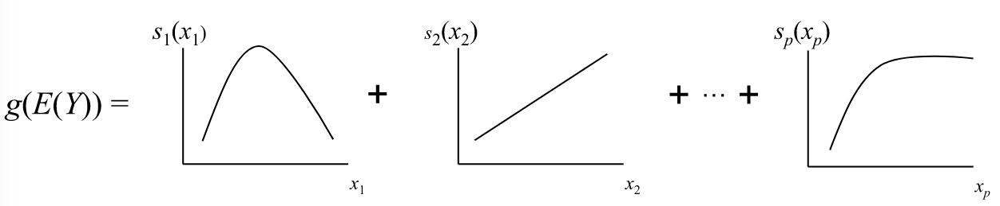
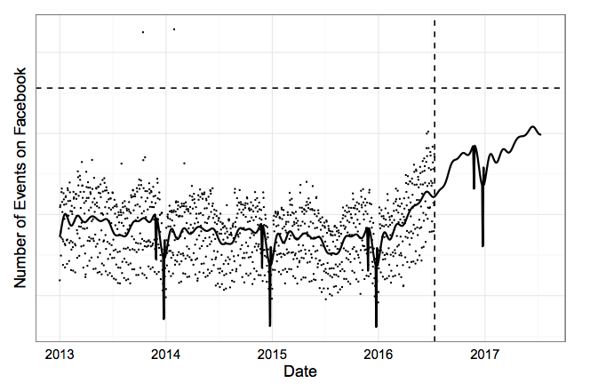

```{r setup, include=FALSE}
options(stringsAsFactors = FALSE)

library(tidyverse)
library(gamlss)
library(knitr)
library(forecast)
library(magrittr)
library(purrrlyr)

opts_chunk$set(cache=TRUE, dpi=150, autodep = TRUE)

theme_set(theme_minimal())

set.seed(1)

```

# 1. Repeated Accumulating Processes

## Problem 1: Forecasting Class Size

<div class="columns-2">

```{r forecasting_class_plot, echo=FALSE, out.width='490px'}
data_frame(days=c(-8.13653924223036, -41.2764017452733, -4.97421451108523, -8.69979094900191, 
-3.51587212830782, -12.1954079083147, -3.37867442829227, -19.4938695016215, 
-12.9251936185629, -8.32626658678055, -32.7134362144356, -9.06191221624613
)) %>%
  ggplot(aes(days)) + 
  geom_density(fill='grey', adjust=2) +
  geom_rug() +
  scale_x_continuous("Days Before Start",
                     limits=c(NA,0)) +
  ylab("") +
  annotate("segment", x = -14, xend = -14, 
           y = .045, yend = .035,
           colour="blue", size=1.5,
           arrow=arrow()) 

```

* _Cancel or Run?_
* Early Warning System
* Imprecision, Accumulating Data

</div>

## Problem 2: Forecasting Monthly Sales

<div class="columns-2">

```{r sales_plot, echo=FALSE, out.width='490px'}
data_frame(x=1:100, mon=sort(rep(1:4,25)),
           y=100+.5*x+.005*(x**1.1)) %>%
  group_by(mon) %>%
  mutate(y2=cumsum(y * rnorm(25, mean = 1, sd=.5))) %>%
  ggplot(aes(x, y2, group=mon)) + 
  geom_line() +
  scale_x_continuous("Month",
                     breaks=c(0,25,50,75,100),
       labels=1:5) +
  ylab("Monthly Sales to Date") +
  annotate("segment", x = 12, xend = 12, 
           y = 2700, yend = 1700,
           colour="blue", size=1.5,
           arrow=arrow()) 

```

* _Will We Meet Sales Targets?_
* Early Warning System
* Imprecision, Accumulating Data

</div>

## Desiderata

* Care about _sum_ of high-variance measurements.
* Grouping is part of data-generating process; not arbitrary.
* Want updates as time progresses.
* Have covariates; not pure time-series.
* Want prediction intervals (honest uncertainty).

## Sales Data (Simulated!)

<div class="columns-2">

```{r simdata, echo=FALSE}
years = 3; dpm = 28 
mo <- function(t) 1 + (t-1) %/% dpm
dom <- function(t) 1 + (t-1) %% dpm
dat <- tibble(t=seq.int(years*12*dpm),
              t_mo=mo(t),
              t_dom=dom(t),
              bts=t_mo%%12 == 8, # Back to School!
              set=factor(ifelse(t > 33*dpm, "Test", "Train"),
                         levels=c("Train", "Test")),
              sales = 100 + (t/5) + 3 * 
                      arima.sim(list(order = c(1,1,0), 
                                     ar = .1), 
                                n = years*12*dpm - 1))
# add bts effect
dat %<>% mutate(sales = sales * (1 + .25 * bts))
# add dom effect
dat %<>% mutate(sales = sales * (1 + .4 * (t_dom/28)^2))
# add both additive and multiplicitive noise
dat %<>% mutate(sales = sales *
                rnorm(years*12*dpm, 1, .2) + 
                rnorm(years*12*dpm, 0, 20))
# force to be *nonnegative integer*
dat %<>% mutate(sales = pmax(0, round(sales)))
```

```{r simdata_plot, echo=FALSE, out.width="490px"}
ggplot(dat, aes(t, sales)) + 
  stat_smooth(method='gam', se=FALSE, size=3) +
  geom_point(aes(color=set), alpha=.4) +
  scale_color_manual("", values=c("black", "red"))
```

```{r simdata_glimpse, echo=FALSE}
glimpse(dat)
```

</div>

## Divide and Conquer {.smaller}

<div class="columns-2">

```{r monthly}
monthly <- dat %>% 
  group_by(t_mo, set, bts) %>%
  summarise(sales=sum(sales))
glimpse(monthly)
```

<br><br><br><br>

```{r daily}
daily <- dat %>%
  group_by(t_mo) %>%
  mutate(monthly_sales=sum(sales),
         bod_sales=lag(sales,  default = 0),
         prop_sales = cumsum(bod_sales) / 
           monthly_sales,
         prop_month=(t_dom-1) / dpm) %>%
  ungroup()
glimpse(daily)
```
</div>

## Divide and Conquer

<div class="columns-2">

```{r prior_graph, echo=FALSE, out.width='490px'}
ggplot(monthly, aes(t_mo, sales, color=set)) +
  geom_line() +
  scale_color_manual("", values=c("black", "red")) +
  scale_x_continuous("Month", breaks=(1:3)*12) +
  scale_y_continuous("Sales", limits = c(0,NA)) +
  ggtitle("Monthly Model (Empirical Prior)") 
  
```

```{r timecourse_plot1, echo=FALSE, out.width='490px'}

ggplot(daily, aes(prop_month, prop_sales, group=t_mo, color=set)) +
  geom_line() +
  scale_color_manual("", values=c("black", "red")) +
  scale_x_continuous("Prop. of Month") +
  scale_y_continuous("Prop. Sales to Date", limits = c(0,NA)) +
  ggtitle("Timecourse Model (part of Likelihood)") 
```

</div>

# 2. Modeling the Prior

1. Repeated Accumulating Processes

## Empirical Bayes

* Prior = monthly sales estimate (from data), prior to seeing any sales
* Likelihood = P(observing sales to date | specific final sales #)
* Posterior = current estimate; prior updated by sales to date

$$
P(\text{forecast sales}=y \vert \text{sales to date}=x) \propto \\ \\
  P(\text{sales to date}=x | \text{frac of month}=z, \text{forecast sales}=y) \cdot P(\text{forecast sales}=y) \\
\text{or} \\
P(\text{fraction sales to date}=\frac{x}{y}|\text{fraction of month}=z)
\cdot
P(\text{forecast sales} = y)
$$


## Modeling the Prior, Conceptually

<div class="columns-2">

```{r prior_concep, echo=FALSE, out.width="490px"}
tibble(Sales=500:1500, d=dnorm(Sales, mean=1000, sd=100)) %>%
  ggplot(aes(Sales, d)) + 
  geom_line() +
  ylab("") 
```


$$ \text{sales} = f(t,x) + N(0, \sigma) \\
\text{sales} = f(t,x) + N(0, g(t,x)) \\
\text{sales} = f(t,x) + ?(0, g(t,x), h(t,x)) $$

</div>

## Generalized Additive Models

"Mathematically speaking, GAM is an additive modeling technique where the impact of the predictive variables is captured through smooth functions which—depending on the underlying patterns in the data—can be nonlinear:"

<center>

</center>

[GAM: The Predictive Modeling Silver Bullet](http://multithreaded.stitchfix.com/blog/2015/07/30/gam/) (Kim Larsen, Stichfix, 2015)

## Prophet

* Facebook's [open-sourced](https://facebookincubator.github.io/prophet/) time-series Bayesian forecasting framework.
* Time is a covariate; Complex seasonality; Non-clockwork periods. 
* Non-accumulating. STAN!

$$ log(y) = s(time) + seasonality + holiday + changepoints + error$$

<center>

</center>

## GAMLSS

* [Generalized Additive Models for Location, Scale, & Shape](http://gamlss.org) <br> (Stasinopoulos & Rigby, 2007)
* LSS = _Independently_ model all parameters of a distribution
* Arbitrary exponential-family distributions, e.g., Skew $t$, Zero-Inflated Poisson, Beta, dozens more...
* Forecast _shape of uncertainty_ in new cases

e.g.:

* Sales ~ spline(time) + back to school
* Var(Sales) ~ time 
* Tail-heaviness(Sales) ~ time


## Modeling the Prior {.smaller}

```{r prior, echo=TRUE}
monthly_training <- filter(monthly, set=="Train")
prior_fit <- gamlss(log(sales) ~ cs(t_mo) + bts,
                    sigma.formula = ~ t_mo, nu.formula = ~ t_mo,
                    family=TF, data=monthly_training,
                    control=gamlss.control(trace=FALSE))
```

```{r prior_fit_out, echo=FALSE}
prior_fit
```


## Modeling the Prior

<center>
```{r prior_plots, echo=FALSE, fig.height=1.8, fig.width=3, dpi=150}
par(mai=c(.5,.54,.2,.25))
term.plot(prior_fit, terms = 1); title("Loc, cs(t_mo)")
term.plot(prior_fit, terms = 2); title("Loc, bts")
term.plot(prior_fit, what='sigma'); title("Scale, t_mo")
term.plot(prior_fit, what='nu'); title("Shape, t_mo")

```
</center>

## Prior Computation

```{r prior_fit, message=FALSE, warning=FALSE, results='hide'}
prior_dist <- function(t_mo, bts, sales_range=2000:15000) {
  with(predictAll(prior_fit, 
                  newdata=data.frame(t_mo=t_mo, bts=bts)),
       data_frame(sales=sales_range,
              d=dTF(log(sales_range), mu=mu, 
                    sigma=sigma, nu=nu),
              t_mo=t_mo, bts=bts) %>%
         mutate(d=d/sum(d)))
}

samp_priors <- data_frame(t_mo=c(15,36), 
                          bts=c(FALSE, TRUE)) %>%
  by_row(~ prior_dist(.$t_mo, .$bts), 
         .collate='rows') 
```

## Prior Computation

```{r oneprior, echo=FALSE, fig.height=3, fig.width=4}
samp_priors %>%
  ggplot(aes(sales, d, group=t_mo, color=t_mo)) + 
  geom_line(size=1.2) +
  xlab("Sales") + ylab("") + 
  theme(legend.position = 'none') 
```

# 3. Updating the Prior

1. Repeated Accumulating Processes
2. Modeling the Prior


## Modeling the Likelihood, Conceptually

$$
P(\text{sales}=y \vert \text{sales to date}=x) \propto \\ \\
  P(\text{sales to date}=x | \text{frac of month}=z, \text{sales}=y) \cdot P(\text{sales}=y) \\
\text{or} \\
P(\text{fraction sales to date}=\frac{x}{y}|\text{fraction of month}=z)
\cdot
P(\text{sales} = y)
$$

```{r likelihood_concept, echo=FALSE, fig.height=2.1, fig.width=3.5, fig.align="center"}
tibble(month_prop=c(.03, .5, .90)) %>%
  by_row(~ tibble(sales_prop=(0:99)/100,
                  d=dBEINF0(sales_prop, mu=.$month_prop,
                            sigma=.1, nu=.2)),
         .collate = 'rows') %>%
  ggplot(aes(sales_prop, d, color=factor(month_prop))) +
  geom_line(size=1.5) +
  facet_grid(factor(month_prop) ~ .) +
  xlab("Sales Proportion") +
  theme(legend.position = 'none') +
  ggtitle("Example Month Proportions")
```


## Modeling the Likelihood

```{r timecourse_mod, include=FALSE}
daily_training <- filter(daily, 
                         set=="Train")
timecourse_fit <- 
  gamlss(prop_sales ~ cs(prop_month),
         sigma.formula = ~ cs(prop_month),
         nu.formula = ~ cs(prop_month),
         data=daily_training,
         family=BEINF0)
```


```{r timecourse_mod_out, echo=FALSE}
timecourse_fit
```

## Modeling the Likelihood

<div class="centered">
```{r likelihood_plots, echo=FALSE, fig.height=1.8, fig.width=3, dpi=150}
par(mai=c(.5,.54,.2,.25))
term.plot(timecourse_fit, what='mu'); title("Loc, cs(prop_month)")
term.plot(timecourse_fit, what='sigma'); title("Scale, cs(prop_month)")
term.plot(timecourse_fit, what='nu'); title("Shape, cs(prop_month)")

```
</div>

## Likelihood Computation

```{r likelihood_fit, message=FALSE, warning=FALSE, results='hide'}
likelihood_dist <- function(prop_month, sales_to_date,
                            sales_range=2000:15000) {
  with(predictAll(timecourse_fit, 
          newdata=data.frame(prop_month=prop_month)),
     tibble(prop_sales=pmin(1, sales_to_date / sales_range),
            sales=sales_range,
            d=dBEINF0(prop_sales, mu=mu, 
                      sigma=sigma, nu=nu)) %>%
       mutate(d = ifelse(prop_sales >= 1, 0, d),
              d = d/sum(d)))
}

samp_likelihoods <- tibble(prop_month=c(.03, .5, .90),
                           std=c(200, 3000, 5000)) %>%
  by_row(~ likelihood_dist(.$prop_month, .$std), 
         .collate='rows') 
```

## Likelihood Computation

```{r onelh, echo=FALSE, fig.height=3, fig.width=4}
samp_likelihoods %>%
  mutate(label=sprintf("%0.2f / %d", prop_month, std)) %>%
  ggplot(aes(sales, d, color=label)) + 
  geom_line(size=1.2) +
  xlab("Sales") + ylab("") + 
  facet_grid(label ~ ., scales = "free_y") +
  theme(legend.position = 'none') +
  ggtitle("Modeled Likelihoods")
```

## Computing the Posterior

$$
\forall y, P(\text{sales}=y \vert \text{sales to date}=x) \propto \\
  P(\text{sales to date}=x | \text{frac of month}=z, \text{sales}=y) \cdot \\ P(\text{sales}=y) 
$$

Algorithm:

* For all plausible final sales numbers,
* Compute the _prior_ and _likelihood_ distributions & multiply,
* Then normalize so the _posterior_ is a distribution.
* Plot or read off quantiles as needed.

## Scenario

<strong>It's December 10th, 2016. We've seen 4000 sales to date. Will we hit
our goal of 10,000 sales?</strong>

<div class="columns-2" style="max-height: 400px">

```{r sample_prior, include=FALSE, results='hide'}
sample_prior <- prior_dist(36, FALSE)

sales_mode <- 
  function(dd) dd$sales[[which.max(dd$d)]]
sales_thresh <- 
  function(dd, th=10000) sum(dd$d[dd$sales >= th])
```

```{r sample_prior_plot, echo=FALSE}
sample_prior %>%
  ggplot(aes(sales, d)) +
  geom_line(size=1.5) + 
  geom_vline(xintercept=10000, color='blue') +
  scale_y_continuous("", labels=NULL) +
  xlab("Sales") +
  ggtitle(paste("Prior: Mode = ", sales_mode(sample_prior), 
                "; P(Sales > 10k) =",
                round(sales_thresh(sample_prior), digits=3)))

```

</div>

<strong>Looks bad, boss...</strong>

## Likelihood

<div class="columns-2">

```{r sample_llh, results='hide'}
sample_llh <- 
  likelihood_dist(prop_month = 10/28,
                  sales_to_date = 4000)
```

```{r sample_llh_plot, echo=FALSE}
sample_llh %>%
  ggplot(aes(sales, d)) +
  geom_line(size=1.5) + 
  geom_vline(xintercept=10000, color='blue') +
  scale_y_continuous("", labels=NULL) +
  xlab("Sales") +
  ggtitle(paste("Mode = ", sales_mode(sample_llh), 
                "; P(Sales > 10k) =",
                round(sales_thresh(sample_llh), digits=3)))

```

</div>

<strong>Chickens Counted!</strong>

## Responsible Bayesians

<div class="columns-2">

```{r sample_post}
sample_post <- 
  data_frame(sales=sample_prior$sales,
             d=sample_prior$d * sample_llh$d) %>%
  mutate(d = d/sum(d))
```

```{r sample_post_plot, echo=FALSE, out.width="490px"}
sample_post %>%
  ggplot(aes(sales, d)) +
  geom_line(size=1.5) + 
  geom_vline(xintercept=10000, color='blue') +
  scale_y_continuous("", labels=NULL) +
  xlab("Sales") +
  ggtitle(paste("Mode = ", sales_mode(sample_post), 
                "; P(Sales > 10k) =",
                round(sales_thresh(sample_post), digits=3)))

```

</div>

<strong>Back to work...</strong>

# 4. Step Back

1. Repeated Accumulating Processes
2. Modeling the Prior
3. Updating the Prior

## Daily Updating

```{r daily_updates, echo=FALSE, results='hide', warning=FALSE}
test_month = 35 
anim_prior <- prior_dist(test_month, FALSE)
anim_daily <- filter(daily, t_mo==test_month) %>%
  mutate(cumul_bod_sales=cumsum(bod_sales),
         cumul_sales=cumsum(sales))
# for each row in daily, generate a row with 5/50/95 quantiles, and plot
nearest_sales <- function(dd, p) {
  nearest <- which.min(abs(dd$ecdf - p))
  dd$sales[[nearest]]
}
anim_quantiles <- 
  anim_daily %>%
  by_row(~ {
           llh <- likelihood_dist(prop_month = .$t_dom/28,
                                  sales_to_date = .$cumul_bod_sales)
           post <- data_frame(sales=llh$sales,
                              d=anim_prior$d * llh$d) %>%
             mutate(d = d/sum(d),
                    ecdf = cumsum(d))
           data_frame(q05 = nearest_sales(post, .05),
                      q50 = nearest_sales(post, .50),
                      q95 = nearest_sales(post, .95))
         }, .collate='rows')
```

```{r daily_updates_plot, echo=FALSE, warning=FALSE, fig.height=3, fig.width=5, fig.align="center"}
ggplot(anim_quantiles, aes(t_dom, q50, ymin=q05, ymax=q95)) + 
  geom_ribbon(alpha=.5) + 
  geom_line() + 
  geom_hline(yintercept=anim_daily$monthly_sales[[1]], color='blue') +
  geom_point(data=tail(anim_daily, 5), 
            mapping=aes(I(t_dom+1), cumul_sales, ymin=NULL, ymax=NULL),
            color='blue') +
  xlab("Day of Month") +
  ylab("Sales") +
  ggtitle("Bayesian Forecast Sales vs Actual", 
          paste("Test Month", test_month))


```

## In Practice

1. Weekends and Holidays
2. Backtesting
3. Future Months
4. Impact and UX

## Pros and Cons

* Prior & Timecourse models can use arbitrary covariates
* Honest about uncertainty
* Semi-parametric models are flexibile, make good use of data


* Fiddly details in implementation, not OTS
* Weird timecourse shapes would require trickier modeling
* Continuous case is hard (but not likely necessary)

# Thanks

<div style="text-color: white">
Build trust: calculate and communicate uncertainty.

Harlan D. Harris, PhD <br>
[Twitter](http://twitter.com/harlanh), 
[Medium](http://medium.com/@harlanh), 
[GitHub](http://github.com/HarlanH): @harlanh

_[This Presentation on GitHub](https://github.com/HarlanH/gamlss_accum)_
</div>

## Auto-regressive Models

$$ X_t = c + \sum_{i=1}^p \phi_i X_{t-1} + \epsilon_t $$

```{r ar}
monthly_ts <- ts(filter(monthly, 
                        set=="Train")$sales, 
                 start=c(2014,1), frequency=12)
monthly_fc <- forecast(auto.arima(monthly_ts, 
                                  max.q=0), 3)
```

***

```{r ar_plot, echo=FALSE}
p <- autoplot(monthly_fc) +
  geom_point(aes(time, sales), 
             data=tibble(time=2016+(9:11)/12, 
              sales=filter(monthly, set=="Test")$sales),
             color='red') +
  scale_y_continuous("Sales", limits=c(0,NA)) +
  theme_minimal()
p
```
